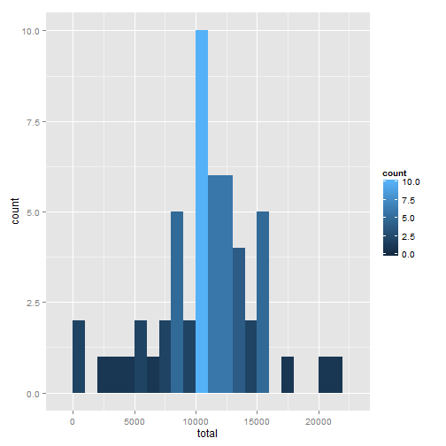
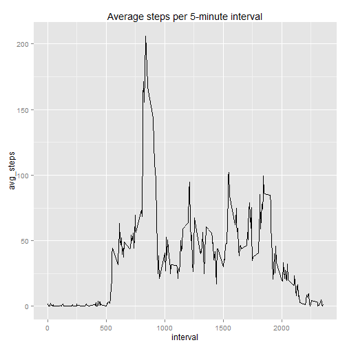
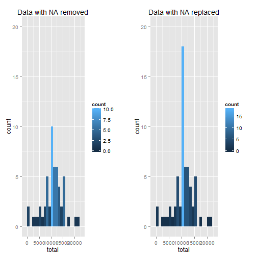
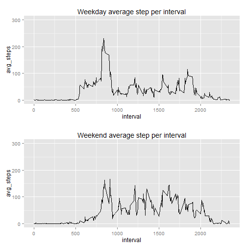

---
title: "Reproducible Research : Peer Assessment 1"
author: "Vincent Chan"
date: "Wednesday, August 12, 2015"
output: html_document
---  
  

**Loading the data & transform**  
1. Firstly, data is loaded and saved into data drame called **activity**  
2. Convert the date column as date   


```r
# Reading the dataset
activity <- read.csv("activity.csv")
activity$date <- as.Date(activity$date, format = "%Y-%m-%d")
```
  
  
  
**What is mean total number of steps taken per day?**  

1. Load **dplyr** package  
2. Removed all rows containing NA values in steps column   
3. Arrange by date column  
4. Summarise by total steps  


```r
suppressMessages(library(dplyr))
totalstep <- 
    activity %>%
    filter(!is.na(steps)) %>%
    group_by(date) %>%
    summarise(total = sum(steps))
```
  
5. Plotting the histogram of total steps taken per day with ggplot2

```r
suppressMessages(library(ggplot2))
ggplot(totalstep, aes(x=total)) + 
    geom_histogram(aes(fill = ..count..), binwidth=1000) 
```

 

6. Calculating the mean  


```r
  mean(totalstep$total)
```

```
## [1] 10766.19
```
  
7. Calculating the median  

```r
  median(totalstep$total)
```

```
## [1] 10765
```

**What is the average daily activity pattern?**  

1. Group by internval and calculate mean of steps per interval  


```r
daily <- activity %>%
    group_by(interval) %>%
    summarise(avg_steps = mean(steps, na.rm = T))
```
  
2. Plot of time series chart for average steps per 5 minute interval  


```r
ggplot(daily, aes(x = interval, y = avg_steps)) + 
    geom_line() +
    ggtitle("Average steps per 5-minute interval")
```

 
  
3. Extract the row of data containing maximum number of average steps.  


```r
daily[which.max(daily$avg_steps), ]
```

```
## Source: local data frame [1 x 2]
## 
##   interval avg_steps
## 1      835  206.1698
```
  
**Imputing missing values**  
  
*The impute strategy to be employed is to fill in NA values  
with mean values per interval*

1. Calculating the total number of NA within dataset


```r
sum(is.na(activity))
```

```
## [1] 2304
```
  
2. Combine both activity data frame and daily data frame together  
3. Replace NA values with corresponding average steps value  
4. Subset the steps, date and interval columns  


```r
merge_data <- full_join(activity, daily, by="interval")
merge_data$steps[is.na(merge_data$steps)] <- merge_data$avg_steps[is.na(merge_data$steps)]
activity_alldata <- select(merge_data, steps, date, interval)

# Creating another copy of data frame for later use
activity_replacedNA <- activity_alldata
```
  
5. Plot original data and all data(with replaced NA) for comparison  


```r
# Plotting the histograme with removed NA data
fig1 <- ggplot(totalstep, aes(x=total)) + 
        geom_histogram(aes(fill = ..count..), binwidth=1000) +
        ylim(0,20) + 
        ggtitle("Data with NA removed")

# Calculate the total of steps by date
activity_alldata <- activity_alldata %>%
    group_by(date) %>%
    summarise(total = sum(steps))

# Plotting the histogram with replaced NA value data
fig2 <- ggplot(activity_alldata , aes(x=total)) + 
        geom_histogram(aes(fill = ..count..), binwidth=1000) +
        ylim(0,20) +
        ggtitle("Data with NA replaced")

# Plot both figures side by side
suppressMessages(library(gridExtra))
grid.arrange(fig1, fig2, ncol=2)
```

 
  
6. Calculating the mean and median  


```r
# Presenting data in a matrix form
summarydata <- matrix(c(mean(totalstep$total), 
                        mean(activity_alldata$total), 
                        median(totalstep$total), 
                        median(activity_alldata$total)), 
                        nrow=2, 
                        ncol=2)

# Rename matrix for better presentation
dimnames(summarydata) = list(c("exclude_NA", "include_NA"), c("mean", "median"))
summarydata
```

```
##                mean   median
## exclude_NA 10766.19 10765.00
## include_NA 10766.19 10766.19
```
  
The mean for excluding NA values and replaced NA values remain the same  

However the median is slightly higher in the replaced NA values case  

**Are there differences in activity patterns between weekdays and weekends?**  
  
*The dataset used here is dataset containing imputed NA values*  


1. Firstly, create a new column call daytype  
2. Reclass daytype as weekday or weekend  
3. Subset data containing only weekday and saved as data frame named days_weekday  
4. Subset data containing only weekend and saved as data drame anmed days_weekend
  

```r
suppressMessages(library(plyr))
daysData <- activity_replacedNA %>%
            mutate(daytype = as.factor(format(date, "%a")))

# Rename the factors named levels with new values
daysData$daytype <- revalue(daysData$daytype, c("Mon" = "Weekday",
                                                "Tue" = "Weekday",
                                                "Wed" = "Weekday",
                                                "Thu" = "Weekday",
                                                "Fri" = "Weekday",
                                                "Sat" = "Weekend",
                                                "Sun" = "Weekend"))
days_weekday <- subset(daysData, daytype == "Weekday")

days_weekend <- subset(daysData, daytype == "Weekend")
```
  
5. Group and summarise the data frame by interval  
6. Plot both the weekday and weekend data for comparison


```r
# For some reason, the following group_by command from dplyr did not work
# It works when plyr package was detached

detach(package:plyr)    

weekday <-  days_weekday %>% 
            group_by(interval) %>% 
            summarise(avg_steps = mean(steps))

weekend <-  days_weekend %>% 
            group_by(interval) %>% 
            summarise(avg_steps = mean(steps))

fig3<-  ggplot(weekday, aes(x=interval, y=avg_steps)) + 
        geom_line() +
        ylim(0,300) +
        ggtitle("Weekday average step per interval")
fig4<-  ggplot(weekend, aes(x=interval, y=avg_steps)) + 
        geom_line() +
        ylim(0,300) +
        ggtitle("Weekend average step per interval")
grid.arrange(fig3, fig4, nrow=2)
```

 
  
From the plots, we can see that the weekday has a higher peak value for average  
steps taken per day compared to weekend. This may be attributed to weekdays  
involve more movements due to usual working days.
